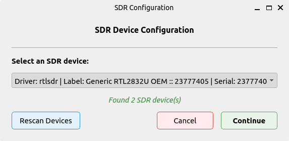

# GNU Radio FM Receiver

<p align="center">
  <a href="https://www.gnuradio.org/">
    
  </a>
</p>

<p align="center">
    <em>A modern FM radio application built with GNU Radio</em>
</p>

---

A feature-rich FM receiver with spectrum scanning, RDS decoding, and multiple streaming capabilities.

## Features

- **Spectrum Scanning & FM Detection** - Automatically find FM stations in your area
- **RDS Decoding** - Display station information and metadata
- **Multi-Stream Recording** - Record multiple stations simultaneously
- **Real-time Audio Processing** - Advanced GNU Radio signal processing backend
- **Modern GUI** - Intuitive interface with frequency controls and station management

## Requirements

### System Dependencies
```bash
# GNU Radio and related packages
sudo apt install gnuradio gr-rds soapysdr-module-all

# Python 3.10+ (required)
python3 --version
```

### Python Dependencies
- Managed automatically via `uv` (numpy, matplotlib, etc.)

## Installation & Setup

1. **Install uv package manager**
   ```bash
   curl -LsSf https://astral.sh/uv/install.sh | sh
   ```

2. **Create virtual environment with system packages**
   ```bash
   python3 -m venv .venv --system-site-packages
   source .venv/bin/activate  # Linux/Mac
   # or
   .venv\Scripts\activate  # Windows
   ```

3. **Run the application**
   ```bash
   uv run src/fm_receiver/main.py
   ```

## Usage

### First Launch
Configure your SDR device through the setup dialog and select from detected hardware.

<p float="left">
   &nbsp;
  
</p>

### Home Page
Listen to stations, navigate with next/previous buttons, and view real-time RDS information.


### Station List
Jump between discovered stations and manage multiple recordings.


### Debug View  
Advanced signal analysis with RF controls and real-time visualizations.


### Key Controls
- **Frequency Slider**: Manual tuning
- **Record Button**: Save current audio stream
- **Scan Button**: Discover FM stations in range
- **RDS Display**: Real-time station information

## Project Structure

```
src/fm_receiver/
├── main.py              # Application entry point
├── app.py               # Main application logic
├── core/                # Configuration management
├── flowgraphs/          # GNU Radio signal processing
├── gui/                 # User interface components
├── utils/               # Helper functions
└── resources/           # Assets and icons
```

## Advanced Features

### Debug Mode
Access detailed signal analysis including:
- FM demodulated signal visualization
- Waterfall spectrum display  
- L+R stereo channel monitoring
- RDS constellation diagram
- Real-time audio waveforms

### Recording Options
- Single station recording
- Multiple simultaneous streams
- Configurable output formats
- Automatic file naming with timestamps

## Troubleshooting

**SDR Not Detected**
```bash
# Check SoapySDR installation
SoapySDRUtil --find

# Verify device permissions (RTL-SDR)
sudo usermod -a -G plugdev $USER
```

**GNU Radio Import Errors**
```bash
# Ensure system site packages are enabled
python -c "import gnuradio; print('GNU Radio OK')"
```

## License

GPL-3.0 license

## Contributing

Contributions welcome! Please ensure GNU Radio compatibility when submitting changes.