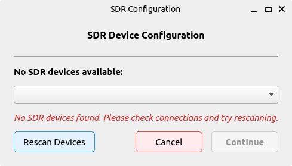
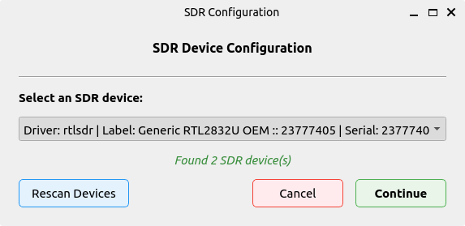
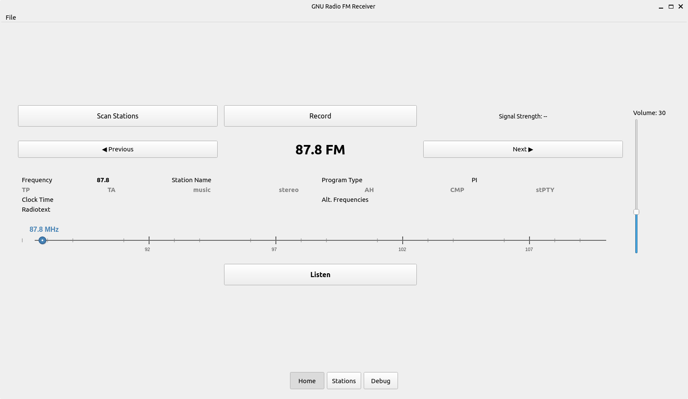
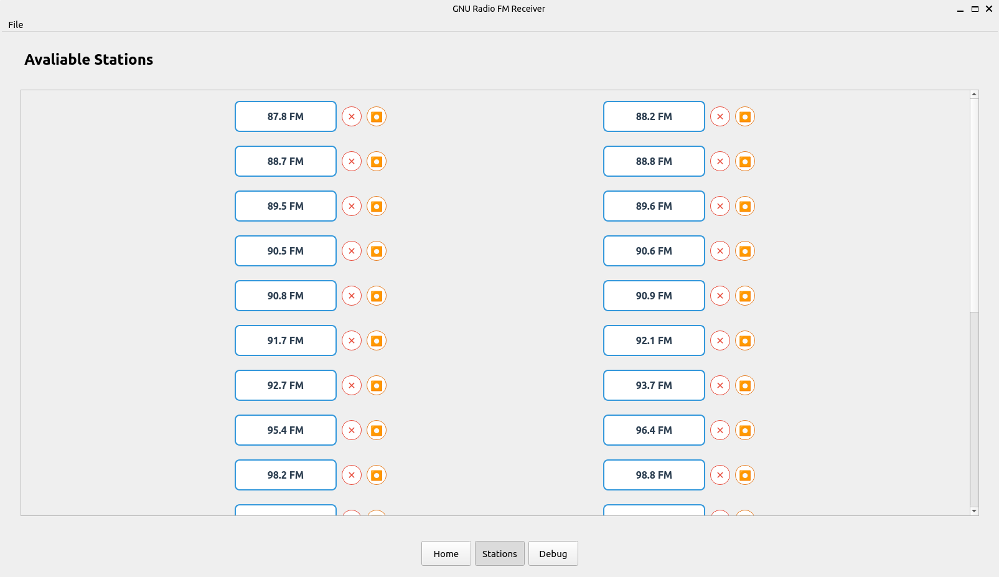
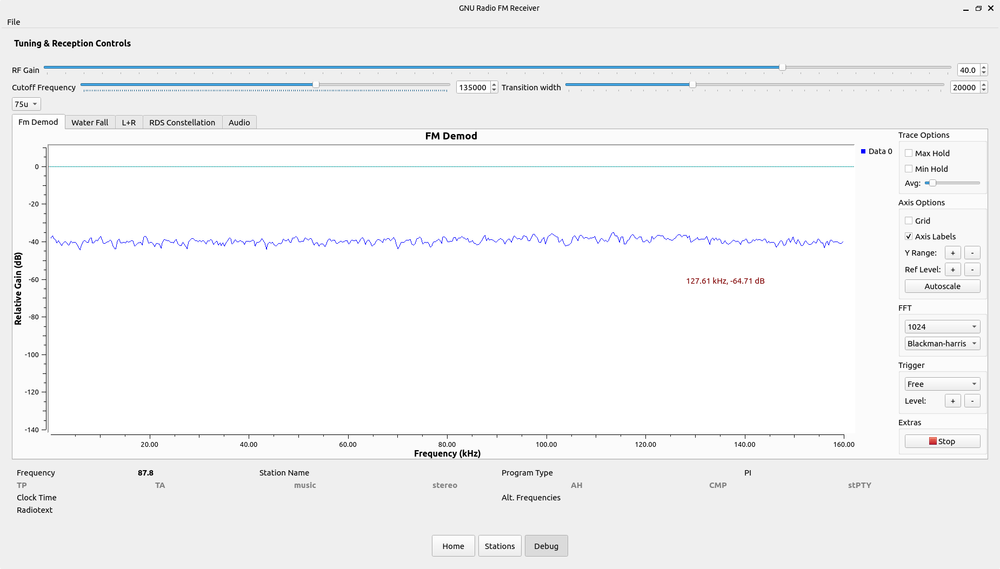

# Welcome to GNU Radio FM application

<p align="center">
  <a href="https://www.gnuradio.org/">
    
  </a>
  <!-- only-mkdocs -->
</p>

<p align="center">
    <em>GNU Radio – A free & open-source toolkit for software radio development.</em>
</p>

---


This project demonstrates how to use GNU Radio flow graphs to abstract the signal processing back end from your application frontend to build a modern functional application in no time.

The key features of this project are:

1. **Spectrum Scanning and FM Detection**
2. **RDS Decoding**
3. **Advance Usage of GNU Radio flowgraphs**
4. **Multiple Streaming Functionality**

The project directory is: 

```bash
├── config
│   └── config.json
├── docs
│   ├── about.md
│   ├── img/
│   │   └── favicon.ico
│   └── index.md
├── downloads
│   └── 2025-08-18_09-01-32.wav
├── LICENSE
├── mkdocs.yml
├── Output.wav
├── pyproject.toml
├── README.md
├── requirements.txt
├── src
│   └── fm_receiver
│       ├── app.py
│       ├── core/
│       │   ├── config_manager.py
│       │   └── __pycache__/...
│       ├── flowgraphs/
│       │   ├── fm_receiver.py
│       │   ├── fm_scanner.{grc,py}
│       │   ├── MultipleRecorder.{block.yml,py}
│       │   ├── rds_rx.{grc,py}
│       │   ├── Recorder.grc
│       │   ├── rds_rx_epy_block_0.py
│       │   └── __pycache__/...
│       ├── gui/
│       │   ├── config_dialog.py
│       │   ├── frequency_slider.py
│       │   ├── info_window.py
│       │   ├── main_window.py
│       │   ├── scan_thread.py
│       │   ├── station_button.py
│       │   ├── volume_slider.py
│       │   └── __pycache__/...
│       ├── main.py
│       ├── resources/icons/record.png
│       ├── utils/
│       │   ├── fm_scanner.py
│       │   ├── logging_config.py
│       │   └── __pycache__/...
│       └── __pycache__/...
├── structure.txt
└── uv.lock
```

## Installation

### Requirements

Ensure the following dependencies are installed on your system:

- [GNU Radio](https://www.gnuradio.org/)
- [gr-rds](https://github.com/bastibl/gr-rds)
- [uv](https://docs.astral.sh/uv/getting-started/)
- Python 3.10
- `numpy`, `matplotlib` (automatically handled by `uv`)
- SoapySDR (`sudo apt install soapysdr-module-all`)


## Running the Project

### Using [uv](https://docs.astral.sh/uv/getting-started/)

1. Install `uv` by following the [installation guide](https://docs.astral.sh/uv/getting-started/installation/).
2. Make sure GNU Radio and `gr-rds` are properly installed on your system.
3. Run the FM receiver:

```bash
uv run src/fm_receiver/main.py
```

Note: Before running, ensure your virtual environment is created with system site packages enabled:

```bash
python3 -m venv .venv --system-site-packages
```

After running, you should be prompted with the SDR config manager that allows you to choose from attached devices.

<p float="left">
   &nbsp;
  
</p>

## Home Page
In the home page you can listen to different stations, the next and previous buttons lets you jump between adjacent stations. 



The RDS information is displayed at the button, along with a frequency slider that shows you what frequency you're listening too. You can also record current sessions and scan area for possible FM stations.

## Station List
The station list view allows you to jump arbitrary between stations. It also has a recording functionality for multiple stream recording.



## Debug View
The debug view allows you to control specific elements of the receiver. Especially :

1. RF Gain
2. Filter Cut off-frequency and transition width
3. [Tau](https://ham.stackexchange.com/questions/9163/pre-emphasis-measurement) Pre-emphasis / De-emphasis Networks



It also features 5 views of the received signal, including 

1. FM Demodulated Signal
2. Waterfall display of demodulated signal
3. L+R stereo display 
4. RDS Constellation 
5. Audio Display