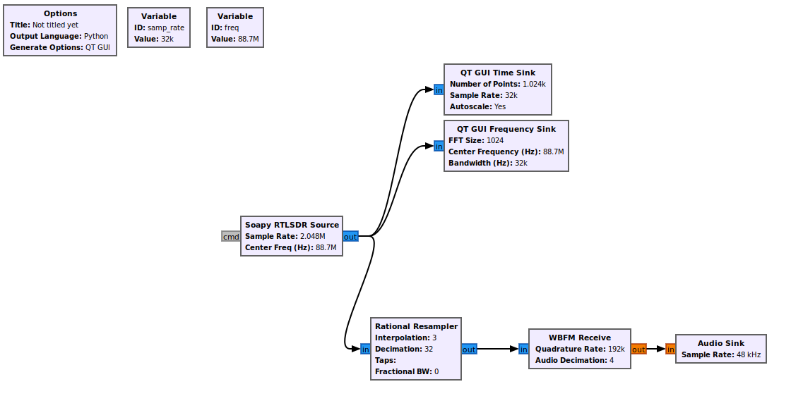

# Tutorials

This comprehensive guide demonstrates how to integrate GNU Radio flowgraphs into custom Python GUI applications, giving you full programmatic control over signal processing workflows.

GNU Radio uses a concept called "flowgraphs" - visual representations of signal processing chains where blocks (filters, modulators, sources, sinks) are connected together. When you create a flowgraph in GNU Radio Companion (GRC), it generates Python code that can be integrated into your applications.

## Integrating GNU Radio to you Python App

### Create Your Flow graph

Start by building a simple FM receiver flow graph following this tutorial [RTL-SDR FM Receiver tutorial](https://wiki.gnuradio.org/index.php?title=RTL-SDR_FM_Receiver). 

Alternatively you can download the GRC file directly from 
```bash
wget https://raw.githubusercontent.com/StudHamza/GNU-Radio-FM-App/main/src/fm_receiver/flowgraphs/fm_receiver.grc
```



Run the file using GNU Radio Companion, and open the generated python file.

---

### Understanding the Generated Code
When you generate Python code from GRC, you get a class structure like this:
```python
class simple_fm_receiver(gr.top_block, Qt.QWidget):
    def __init__(self):
        gr.top_block.__init__(self, "Simple FM Receiver")
        Qt.QWidget.__init__(self)
        
        # Variables (can be modified at runtime)
        self.freq = freq = 101.1e6  # Center frequency
        self.samp_rate = samp_rate = 2048000  # Sample rate
        
        # Blocks
        self.rtlsdr_source = osmosdr.source(args="numchan=1")
        self.low_pass_filter = filter.fir_filter_ccf(...)
        self.analog_wfm_rcv = analog.wfm_rcv(...)
        self.audio_sink = audio.sink(48000)
        
        # Connections
        self.connect((self.rtlsdr_source, 0), (self.low_pass_filter, 0))
        # ... more connections
    
    def closeEvent(self, event):
        self.settings = Qt.QSettings("GNU Radio", "fm_receiver")
        self.settings.setValue("geometry", self.saveGeometry())
        self.stop()
        self.wait()

        event.accept()

    # Getters and Setters
    def get_samp_rate(self):
        return self.samp_rate

    def set_samp_rate(self, samp_rate):
        self.samp_rate = samp_rate

    def get_freq(self):
        return self.freq

    def set_freq(self, freq):
        self.freq = freq
        self.qtgui_sink_x_0.set_frequency_range(self.freq, 2.048e6)
        self.soapy_rtlsdr_source_0.set_frequency(0, self.freq)

    def get_fft_size(self):
        return self.fft_size

    def set_fft_size(self, fft_size):
        self.fft_size = fft_size
```

Look for the `main` function at the very end of the file.

```python
def main(top_block_cls=simple_fm_receiver, options=None):
    tb = top_block_cls()

    def sig_handler(sig=None, frame=None):
        tb.stop()
        tb.wait()

        sys.exit(0)

    signal.signal(signal.SIGINT, sig_handler)
    signal.signal(signal.SIGTERM, sig_handler)

    tb.start()

    try:
        input('Press Enter to quit: ')
    except EOFError:
        pass
    tb.stop()
    tb.wait()


if __name__ == '__main__':
    main()

```
The parameter `top_block_clls=simple_fm_receiver` is your flow graph, which inherits the `gr.top_block`. The Key Methods of interest here are

1. [Start](https://www.gnuradio.org/doc/doxygen/classgr_1_1top__block.html#a0998eed8b4ec2eec1f81fc52431da8ae): Start the contained flowgraph. Creates one or more threads to execute the flow graph. Returns to the caller once the threads are created. 
2. [Stop](https://www.gnuradio.org/doc/doxygen/classgr_1_1top__block.html#ac3e0efc1a20e82ccd6a4eadf1f7f4f13): Stop the running flowgraph. Notifies each thread created by the scheduler to shutdown, then returns to caller.
3. [Wait](https://www.gnuradio.org/doc/doxygen/classgr_1_1top__block.html#a1480656715c15c51ee238a28d397bd30):Wait for a flowgraph to complete. Flowgraphs complete when either (1) all blocks indicate that they are done, or (2) after stop() has been called to request shutdown. 

### Your application 

Create a new python virtual environment make sure to include system packages so that your code can find GNU Radio.

**Note**: Make sure to include system packages so that your interpreter can find the GNU Radio library 
``` bash
# Create environment
python -m venv .venv --system-site-packages

# Activate (Linux/Mac)
source .venv/bin/activate

# Activate (Windows)
.venv\Scripts\activate

```

Create your application file, `app.py` and include the following code to start a pyqt5 application with a single button to toggle the flowgraph, make sure that both the flowgraph file and your app is in same directory, or can access one another to import your top block fm receiver.

```python
import sys
from PyQt5.QtWidgets import QApplication, QPushButton, QWidget, QVBoxLayout
# First Import your flowgraph
from fm_receiver import fm_receiver

class FM(QWidget):
    def __init__(self):
        super().__init__()
        self.setWindowTitle("PyQt5 Simple FM Example")

        # Instantiate FM Receiver App
        self.tb = fm_receiver()
        self.setMinimumSize(700, 500)

        # State variable
        self.listening = False 

        # Layout
        layout = QVBoxLayout()

        # Button
        self.button = QPushButton("Start Listening")
        self.button.clicked.connect(self.toggle_listening)  # connect click event
        layout.addWidget(self.button)

        self.setLayout(layout)

    def toggle_listening(self):
        """Toggle listening state and update button text."""
        self.listening = not self.listening

        if self.listening:
            self.button.setText("Stop Listening")
            print("Listening started...")
            self.tb.start()
        else:
            self.button.setText("Start Listening")
            print("Listening stopped.")
            self.tb.stop()
            self.tb.wait()


if __name__ == "__main__":
    app = QApplication(sys.argv)
    window = FM()
    window.show()
    sys.exit(app.exec_())
```

The first step is to import your flowgraph and instantiate it in the init of your application in order to control it from anywhere.

```python
from yourdirectory.simple_fm import simple_fm
.
.
.

# Instantiate FM Receiver App
self.tb = simple_fm()
```

Then the button will toggle the flowgraph allowing the user to stop or continue the flowgraph on command.

```python
    def toggle_listening(self):
        """Toggle listening state and update button text."""
        self.listening = not self.listening

        if self.listening:
            self.button.setText("Stop Listening")
            print("Listening started...")
            self.tb.start()
        else:
            self.button.setText("Start Listening")
            print("Listening stopped.")
            self.tb.stop()
            self.tb.wait()
```

### Run your application

Finally, Run your application, and you now have your first python application with GRC backend. This way you can control anything in your flowgraph, from simple setting the center frequency to more advanced usage like disconnected and connecting blocks.

## Advance Features

This section covers more advance controls that can make your python app manage every single detail of your flowgraph. This explanation is specific for the FM Application but can be applied anywhere else. The topics covered in this tutorial are:

1. Variable Control 
2. Use GRC GUI elements in your python application
3. Using parameters for your flowgraph
4. Advance control over blocks, by disconnecting and reconnecting blocks

### Setting Variables 

If you click the on the listen button there is a big possibility that you'll hear some noise. In order to listen to an actual station you need to be able to tune to a specific center frequency. Looking at the python generated file, you'll find at the very bottom some getters and setters:

```python
    def set_freq(self, freq):
        self.freq = freq
        self.qtgui_freq_sink_x_0.set_frequency_range(self.freq, self.samp_rate)
        self.qtgui_waterfall_sink_x_0.set_frequency_range(self.freq, self.samp_rate)
        self.soapy_rtlsdr_source_0.set_frequency(0, self.freq)
```

So in order to set frequency, you need to tie this method to a GUI element in your application. You can get as create as you want with the widget, but for the sake of simplicity lets use `QSlider`.

Add a Slider widget along with a function to handle changing the frequency.
```python
        # Frequency Label
        self.freq_label = QLabel("Frequency: 100 MHz")
        layout.addWidget(self.freq_label)

        # Frequency Slider
        self.freq_slider = QSlider(Qt.Horizontal)
        self.freq_slider.setMinimum(88000000)   # 88 MHz
        self.freq_slider.setMaximum(108000000)  # 108 MHz
        self.freq_slider.setValue(int(self.tb.get_freq()))    # Default 100 MHz        
        self.freq_slider.setTickInterval(int(1e6))  # 1 mhz step
        self.freq_slider.setSingleStep(100000)
        self.freq_slider.valueChanged.connect(self.change_frequency)
        layout.addWidget(self.freq_slider)
```

```python
    def change_frequency(self, freq):
        """Update FM receiver frequency from slider."""
        self.tb.set_freq(freq)
        self.freq_label.setText(f"Frequency: {freq/1e6:.1f} MHz")
        print(f"Frequency set to {freq/1e6:.1f} MHz")
```

We've used the `get_freq()` method to set the default value of the slider just as the current frequency of our receiver. And used the `set_freq()` method to edit the SDRs center frequency and listen t0 multiple stations.


### Using GUI Blocks 
To tune into stations, we can look for peaks in the frequency-domain view of our signal. GNU Radio’s QT Frequency Sink makes this easy by showing the signal spectrum in real time.

When you generate your flowgraph, check the Python file: GUI elements are added to the QT layout with addWidget(). The variables passed here (usually ending in _win) are the widget objects you can embed directly into your application.

```python
        self._qtgui_freq_sink_x_0_win = sip.wrapinstance(self.qtgui_freq_sink_x_0.qwidget(), Qt.QWidget)
        self.top_layout.addWidget(self._qtgui_freq_sink_x_0_win)
```

### Disconnecting and Connecting Blocks

Suppose you want to record a specific stream only when triggered by a button press. Fortunately, GNU Radio allows you to control your flowgraph programmatically from within your Python application. This means you can dynamically connect and disconnect blocks as needed.

In this example, we’ll demonstrate how to connect an audio sink to an FM decoder when the recording action is triggered.

You can approach this in two ways:

1. Create the block directly in Python by checking the block’s constructor (from API refernce) and instantiating it in your code.

2. (My Way) Add the block to your GNU Radio flowgraph in the Companion (GRC), then generate the Python code. By reviewing the generated code, you can see exactly how the block is constructed and how the connections are defined. This method makes it easier to understand the correct parameters and wiring before you replicate it programmatically.

After Adding the block to the flowgraph, here is the python code for the wave file sink block:

```python
from gnuradio import audio
.
.
.
        self.blocks_wavfile_sink_0 = blocks.wavfile_sink(
            'filename',
            1,
            samp_rate,
            blocks.FORMAT_WAV,
            blocks.FORMAT_PCM_16,
            False
            )
    ##################################################
    # Connections
    ##################################################
        self.connect((self.analog_wfm_rcv_0, 0), (self.blocks_wavfile_sink_0, 0))
```
So lets get back to our application and create a button to trigger recording in a specific file.

The first step is to initialize the block:

```python
from gnuradio import blocks

# Initialize wavfile sink (but don't connect yet)
self.recorder = blocks.wavfile_sink(
    'recording.wav',        # Output file
    1,                      # Number of channels
    int(48e3), 
    blocks.FORMAT_WAV,
    blocks.FORMAT_PCM_16,
    False
)
```

Then add record button

```python
# Record button
self.recording = False
self.record_button = QPushButton("Start Recording")
self.record_button.clicked.connect(self.toggle_recording)
layout.addWidget(self.record_button)
```

Finaly create a function to toggle recording and stopping:

```python
def toggle_recording(self):
    """Toggle audio recording by connecting/disconnecting wavfile_sink."""
    self.recording = not self.recording

    if self.recording:
        self.record_button.setText("Stop Recording")
        print("Recording started...")

        # Dynamically connect FM decoder to wavfile sink
        self.tb.stop()
        self.tb.wait()  
        self.tb.connect((self.tb.analog_wfm_rcv_0, 0), (self.recorder, 0))
        self.tb.start()
    else:
        self.record_button.setText("Start Recording")
        print("Recording stopped.")

        # Disconnect wavfile sink
        self.tb.stop()
        self.tb.wait()
        try:
            self.tb.disconnect((self.tb.analog_wfm_rcv_0, 0), (self.recorder, 0))
        except Exception as e:
            print("Already disconnected:", e)
        self.tb.start()
```

The full application code is:

```python
import sys
from PyQt5.QtWidgets import QApplication, QPushButton, QWidget, QVBoxLayout, QSlider, QLabel
from PyQt5.QtCore import Qt

# Import your flowgraph
from fm_receiver import fm_receiver
from gnuradio import audio, blocks


class FM(QWidget):
    def __init__(self):
        super().__init__()
        self.setWindowTitle("PyQt5 FM Receiver with Recording")

        # Instantiate FM Receiver App
        self.tb = fm_receiver()
        self.setMinimumSize(700, 500)

        # State variables
        self.listening = False
        self.recording = False

        # Initialize recording block (not yet connected)
        self.recorder = blocks.wavfile_sink(
            'recording.wav',                # Output filename
            1,                              # Number of channels
            int(48e3),         # Sample rate from flowgraph
            blocks.FORMAT_WAV,
            blocks.FORMAT_PCM_16,
            False
        )

        # Layout
        layout = QVBoxLayout()

        # Listening Button
        self.listen_button = QPushButton("Start Listening")
        self.listen_button.clicked.connect(self.toggle_listening)
        layout.addWidget(self.listen_button)

        # Recording Button
        self.record_button = QPushButton("Start Recording")
        self.record_button.clicked.connect(self.toggle_recording)
        layout.addWidget(self.record_button)

        # Frequency Label
        self.freq_label = QLabel("Frequency: 100 MHz")
        layout.addWidget(self.freq_label)

        # Frequency Slider
        self.freq_slider = QSlider(Qt.Horizontal)
        self.freq_slider.setMinimum(88000000)   # 88 MHz
        self.freq_slider.setMaximum(108000000)  # 108 MHz
        self.freq_slider.setValue(int(self.tb.get_freq()))  # Default 100 MHz
        self.freq_slider.setTickInterval(int(1e6))  # 1 MHz step
        self.freq_slider.setSingleStep(100000)
        self.freq_slider.valueChanged.connect(self.change_frequency)
        layout.addWidget(self.freq_slider)

        # Add the Frequency Sink widget from GNU Radio (Qt GUI block)
        layout.addWidget(self.tb._qtgui_freq_sink_x_0_win)

        self.setLayout(layout)

    def toggle_listening(self):
        """Toggle listening state and update button text."""
        self.listening = not self.listening

        if self.listening:
            self.listen_button.setText("Stop Listening")
            print("Listening started...")
            self.tb.start()
        else:
            self.listen_button.setText("Start Listening")
            print("Listening stopped.")
            self.tb.stop()
            self.tb.wait()

    def toggle_recording(self):
        """Toggle audio recording by connecting/disconnecting wavfile_sink."""
        self.recording = not self.recording

        if self.recording:
            self.record_button.setText("Stop Recording")
            print("Recording started...")

            # Dynamically connect FM decoder to wavfile sink
            self.tb.stop()
            self.tb.wait()
            self.tb.connect((self.tb.analog_wfm_rcv_0, 0), (self.recorder, 0))
            self.tb.start()
        else:
            self.record_button.setText("Start Recording")
            print("Recording stopped.")

            # Disconnect wavfile sink
            self.tb.stop()
            self.tb.wait()
            try:
                self.tb.disconnect((self.tb.analog_wfm_rcv_0, 0), (self.recorder, 0))
            except Exception as e:
                print("Already disconnected:", e)
            self.tb.start()

    def change_frequency(self, freq):
        """Update FM receiver frequency from slider."""
        self.tb.set_freq(freq)
        self.freq_label.setText(f"Frequency: {freq/1e6:.1f} MHz")
        print(f"Frequency set to {freq/1e6:.1f} MHz")

if __name__ == "__main__":
    app = QApplication(sys.argv)
    window = FM()
    window.show()
    sys.exit(app.exec_())

```