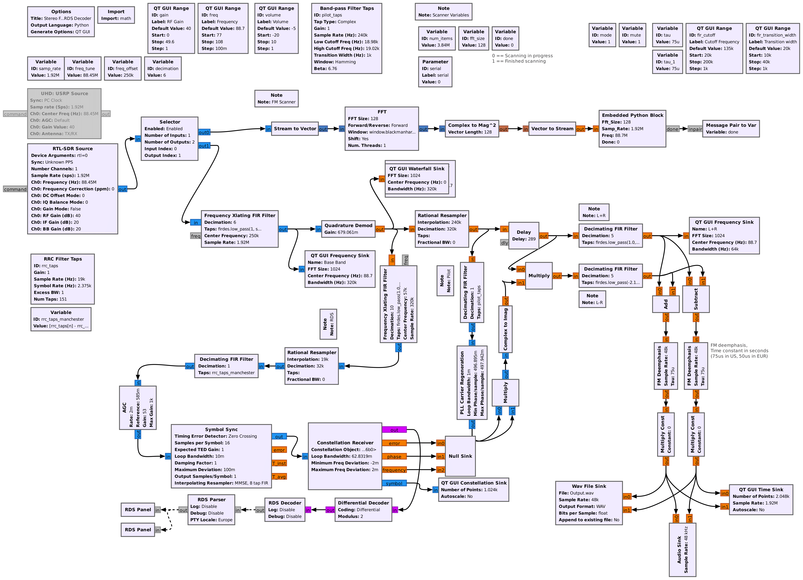

# `flowgraphs/` Directory Documentation

## Purpose
This directory contains **GNU Radio flowgraphs** and supporting code for an FM receiver with **RDS (Radio Data System)** support, as well as a **frequency scanner** and multi-stream recording blocks.

It serves as the main workspace for designing, running, and testing flowgraphs in GNU Radio Companion (GRC).

The current FM player is the [gr-rds](https://github.com/bastibl/gr-rds) with modifications for the application.

---

## Contents

### 🔹 Flowgraphs (`.grc`)
- `fm_scanner.grc` – Scanner flowgraph that sweeps frequencies and locks onto active stations
- `rds_rx.grc` – Flowgraph for FM reception with RDS decoding
- `Recorder.grc` – Flowgraph demonstrating multi-stream recording

### 🔹 Auto-generated Python (`.py`)
- `fm_receiver.py` – Initial python version of the main FM receiver flowgraph
- `fm_scanner.py` – Python version of the scanner flowgraph
- `rds_rx.py` – Main python version of the RDS flowgraph (***Note* Current scanner**)

> **Do not manually edit** these `.py` files. They are auto-generated from `.grc`.

### 🔹 Hierarchical & Custom Blocks
- `MultipleRecorder.block.yml` – Custom hierarchical block definition for multi-stream recording
- `MultipleRecorder.py` – Python implementation for the block
- `rds_rx_epy_block_0.py` – Embedded Python block used inside `rds_rx.grc`

### 🔹 Other
- `__init__.py` – Makes this directory importable as a Python package
- `__pycache__/` – Compiled Python cache files (safe to delete)
- `README.md` – This documentation file

---

## Flowgraph Overview

### FM Receiver + RDS
The RDS flowgraph decodes stereo FM audio and extracts RDS metadata (station name, program info, song titles).

### Scanner
The **scanner flowgraph** (`fm_scanner.grc`) implements:
- Frequency sweep across a defined band
- Signal presence detection
- Automatic tuning to active FM stations
- Integration with the RDS chain

### Multi-Stream Recording
The **`MultipleRecorder` hierarchical block** enables recording from multiple streams simultaneously.

---

## References

* [GNU Radio Documentation](https://wiki.gnuradio.org/index.php/Main_Page)
* [RDS Standard](https://www.rds.org.uk)
* [Embedded Python Blocks](https://wiki.gnuradio.org/index.php/Embedded_Python_Block)
